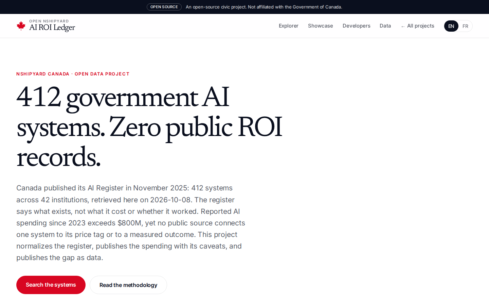
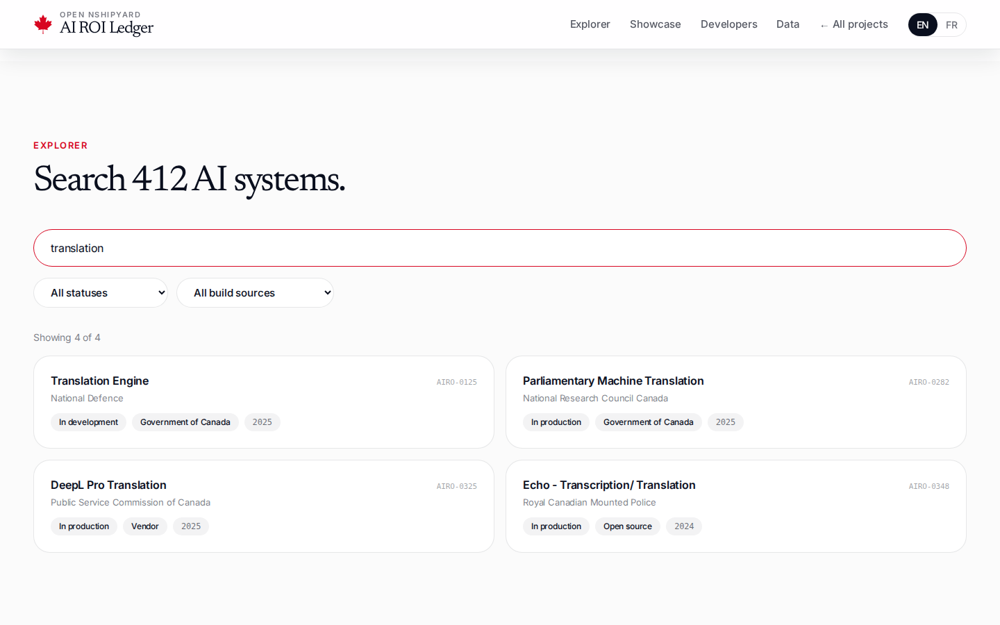
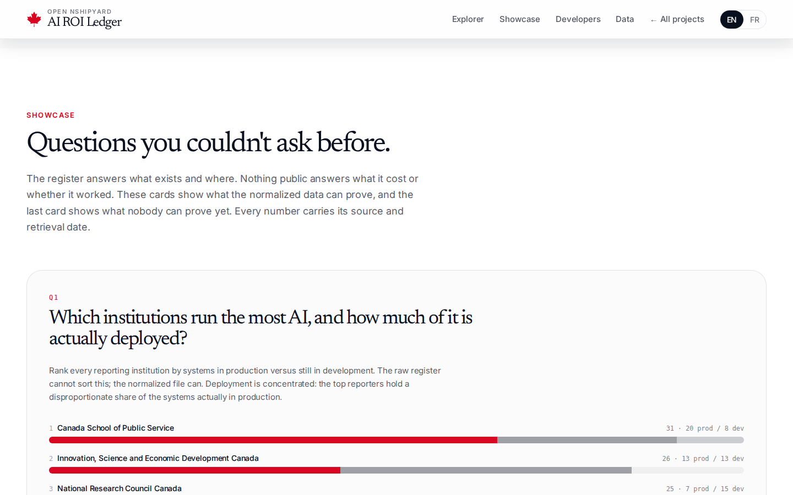
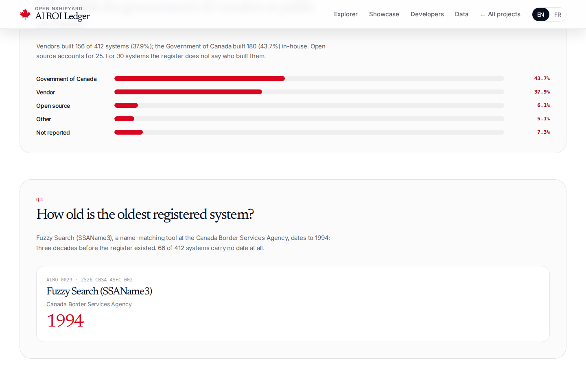
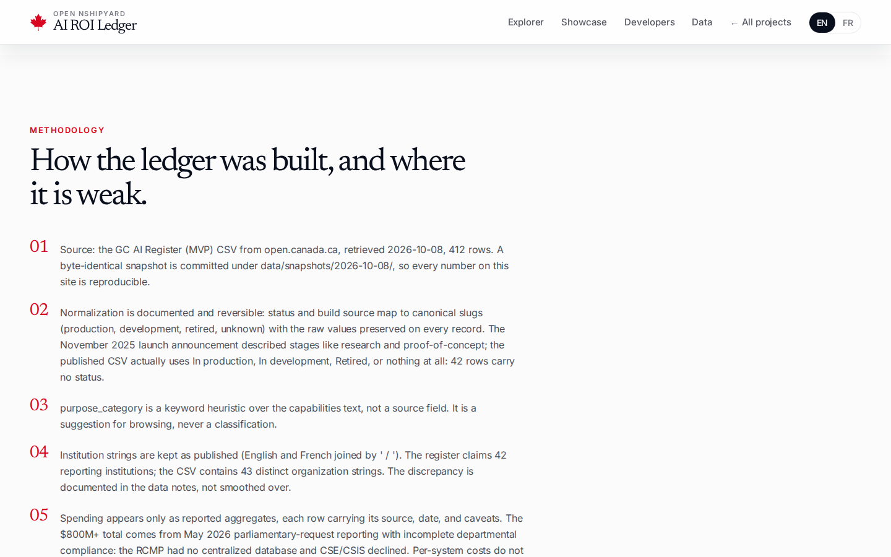
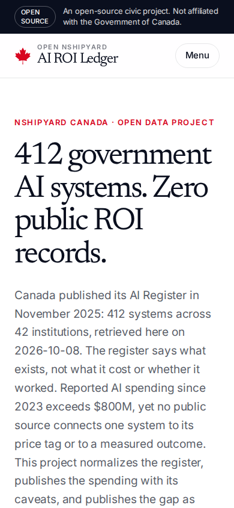
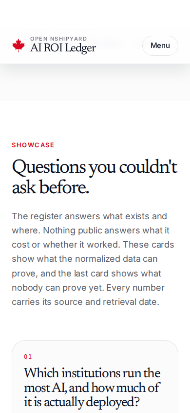

# canada-ai-roi-ledger

The Public-Sector AI ROI Ledger: Canada's federal AI Register (412 systems, 42 institutions) normalized with stable AIRO-0001 IDs, reported AI spending since 2023 published with its caveats, and the outcome-join schema published intentionally empty.

Canada published its AI Register in November 2025. The register says what exists, not what it cost or whether it worked. Reported federal AI spending since 2023 exceeds $800M, yet no public source connects one system to its price tag or to a measured outcome. This project ingests the register (MVP snapshot retrieved 2026-10-08 from open.canada.ca), normalizes status and build source with raw values preserved, and publishes the gap as data: the outcome-join table has 0 rows, and the three missing links are named.

An open-source civic project. Not affiliated with the Government of Canada.

## Screenshots









## Data

- Source: GC AI Register (MVP) CSV, open.canada.ca, retrieved 2026-10-08. Byte-identical snapshot committed under `data/snapshots/2026-10-08/`.
- `data/systems.json`: 412 normalized records with stable AIRO-0001 IDs.
- `data/summary.json`: aggregates, institution ranking, oldest system, data-quality notes.
- `data/spend.json`: reported AI spending aggregates only, every row carrying source, date, and caveats. Per-system costs do not exist in any public source.
- `data/outcome_join.json`: the outcome-join schema with 0 rows and the three missing data links named.
- Downloads (CSV/JSON) are served from `public/data/`.

Key findings from the normalized register: 160 systems In production, 182 In development, 28 retired, 42 with no status. Vendors built 156 systems (37.9%), the Government of Canada built 180 (43.7%) in-house. The oldest registered system is Fuzzy Search (SSAName3) at the Canada Border Services Agency, dating to 1994. The launch announcement described stages like research and proof-of-concept; the published CSV actually uses In production, In development, Retired, or nothing at all.

## Site

Next.js 16, English and French. Pages: system explorer (search plus status and build-source filters), the "Questions you couldn't ask before" showcase, methodology with tiered honesty (observed facts vs reported aggregates vs modeled estimates, which do not appear here), REST API (`/api/v1/*`) with OpenAPI docs, MCP tools over streamable HTTP (`/mcp`), and downloadable CSV/JSON.

## Development

```bash
python3 scripts/build_data.py   # rebuild derived data from the committed snapshot
npm ci
npm run build
npm start
```

## Author

Richardson Dackam: [X](https://x.com/richardsondx) · [GitHub](https://github.com/richardsondx)

## License

MIT
